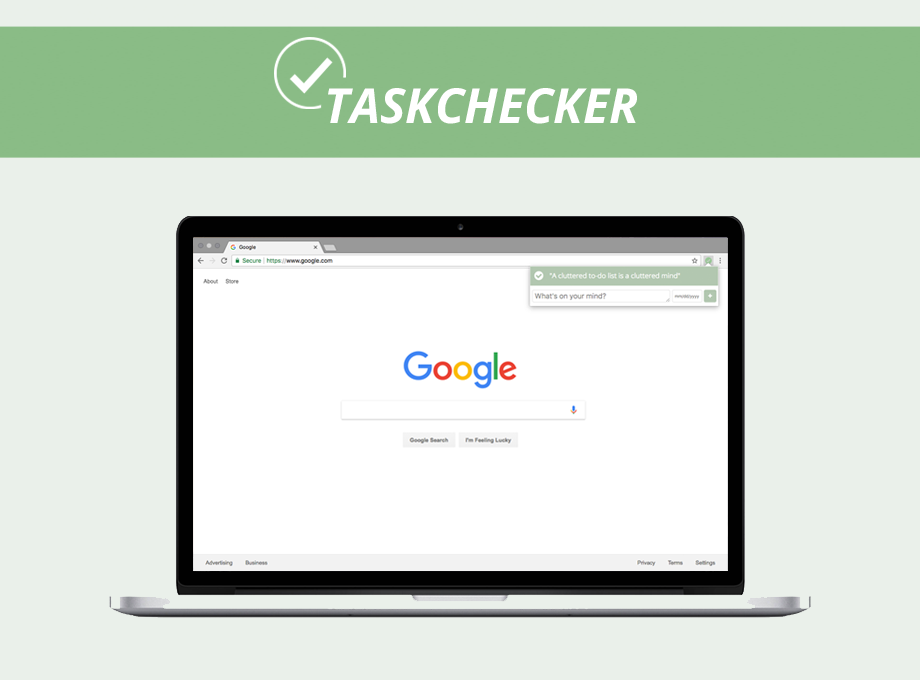
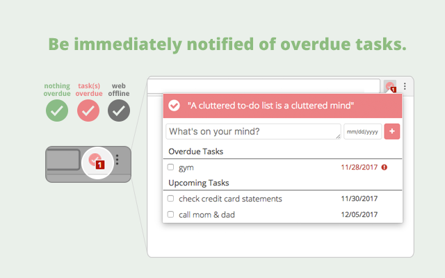

# Task Checker Chrome Extension 

### Easily manage your Google Tasks

Get a button on your browser toolbar that you can click to see overdue and upcoming tasks from Google Tasks, without ever leaving your page.
The button turns red to notify you whenever you have an overdue task.

## Features

#### Browser toolbar button
Get a quick glimpse into your tasks status. A green icon means you don't have any overdue tasks. A red icon means you have an overdue task. It will also display a badge with the number of overdue tasks you need to complete.

#### Popup
Clicking on the toolbar button will open a popup that gives you a window into your tasklist. You'll receive a consolidated view of all your tasks across all your task lists to get a holistic view of your tasks.
* See your overdue and upcoming tasks
* Mark your overdue and upcoming tasks as complete
* Create a new task 

#### Syncing with Google Tasks
This app syncs with the Google API every minute for any updates to your task list. So if you make a change to your task list externally and don't see it reflected in the app, give it a couple minutes to sync with Google. 

## Running the code
1. Make sure you have gulp and npm installed. You'll also need to be able to run `sed`, `jq`, and `mkdir` from the command line.
2. To run the app, you will need to have the environment variables specified in the `config/readme`. For development purposes, you can use the `CLIENT_ID` specified in the `config/readme.md` file  
    * To set an environment variable run the following command in a bash environment:
      > export \<environment key>=\<variable here>
3. `npm install` to install project dependencies
4. `gulp test` to lint & make sure the tests pass
5. `gulp dev` will create a `dist/` folder containing the bundled app that can then be loaded into a Google Chrome browser. Instructions [here](https://developer.chrome.com/extensions/getstarted#unpacked). `gulp dev` will watch your javascript files for changes and automatically update `dist/` with the latest changes -- for HTML changes, you'll have to rerun `gulp dev`
6. `gulp karma-server` will run a Karma server that watches your files for any changes and automatically run the tests when any javascript files have changed

## Deploying the app
Currently Travis handles deployments to the prod and dev environment whenever the "master" and "develop" branch changes, respectively. The deploy script is in `deployToWebStore.sh`. 

A deployment will only successfully publish if the version in `manifest.json` has a semantic version greater than the current version on the Chrome store. You can use the command `gulp dist --type {major, minor, patch}` to handle incrementing the MAJOR.MINOR.PATCH version in `package.json` and `manifest.json` 
 
